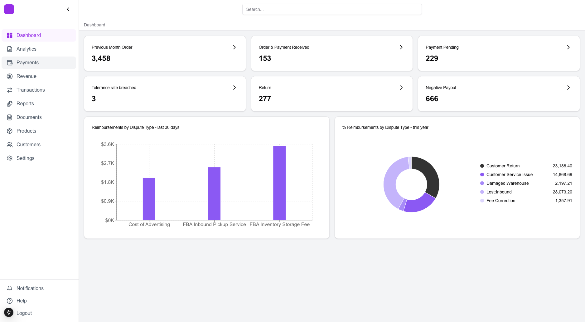

# Interface Frontend




This is the frontend for **Interface**, a file analysis application built with **Next.js**, **pnpm**, and **Shadcn UI**. It allows users to upload two files, analyze them, and view detailed reports on the dashboard.

## Features

- **File Upload**: Users can upload two files for analysis.
- **Report Analysis**: On clicking the "Analyse" button, the app processes the files and redirects users to the dashboard page with the results.
- **UI Framework**: Clean and responsive interface powered by Shadcn UI.
- **Modern Build System**: Built with pnpm for fast and reliable package management.

## Tech Stack

- **Next.js and TypeScript**: Framework for server-rendered React applications.
- **pnpm**: Fast, disk-efficient package manager.
- **Shadcn UI**: Modular and themeable component library for Next.js.

## Getting Started

### Prerequisites

- **Node.js** (>= 16.0.0)
- **pnpm** (>= 7.0.0)

### Installation

1. Clone the repository:

   ```bash
   git clone https://github.com/shivxmr/interface-frontend.git
   cd interface-frontend

2. Install dependencies:


   pnpm install

3. Start the development server:

   ```bash
    pnpm dev

4. Open the app in your browser at http://localhost:3000.

